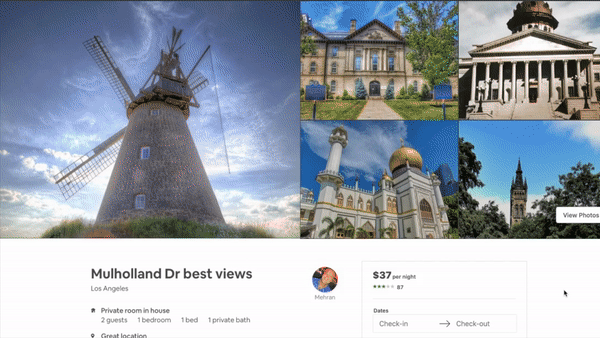

# Cave Inn
<p align='center'>
  <div></div>
</p>    


## Table of Contents

1. [Getting Started](#getting-started)
1. [Requirements](#requirements)
1. [Related Projects](#related-projects)

## Getting Started


From within the root directory:

```sh
npm install
npm run seed
npm run start
```

## Requirements

- Node 6.13.0
- MySQL

## Related Projects

  - https://github.com/reservations/nearby
  - https://github.com/reservations/photo-carousel
  - https://github.com/reservations/reviews
